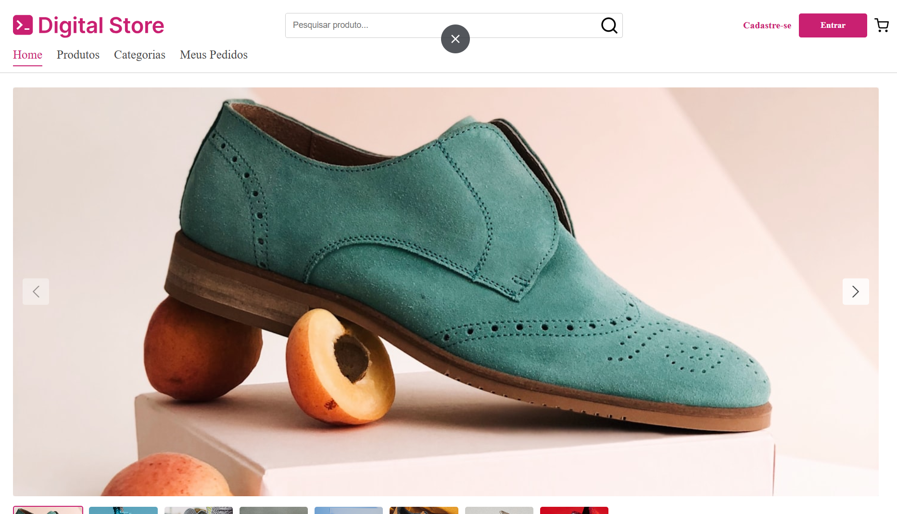
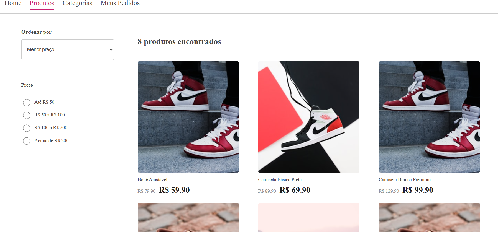
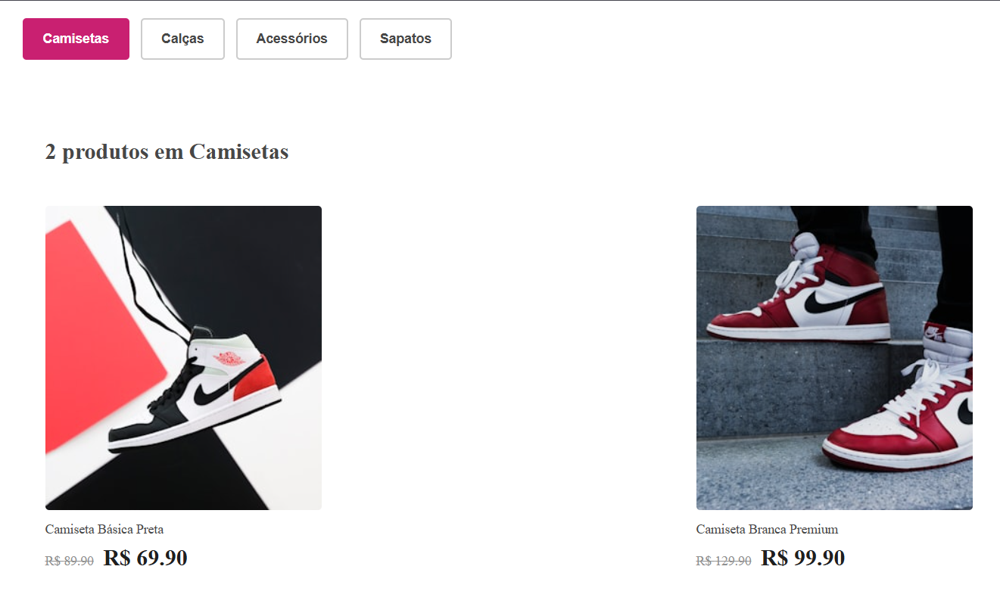
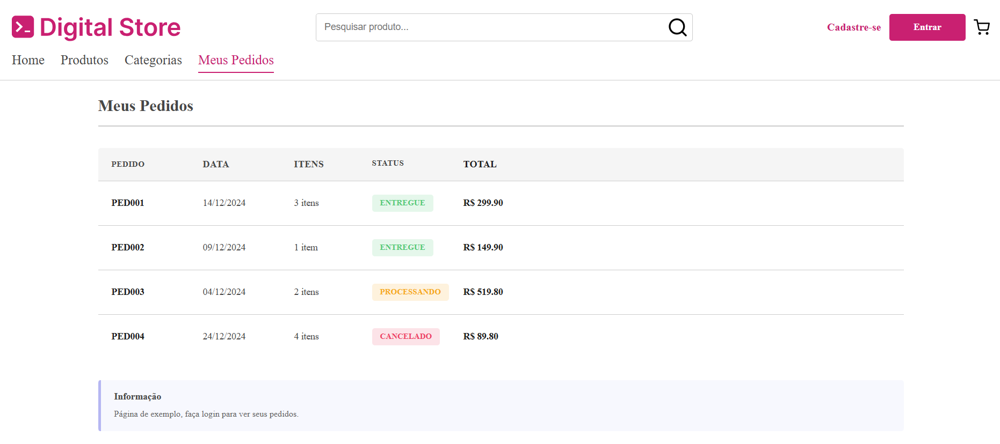
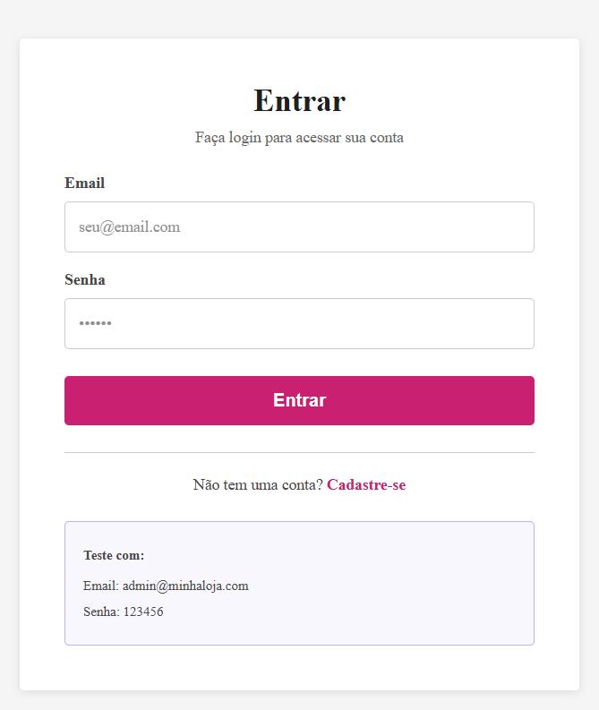
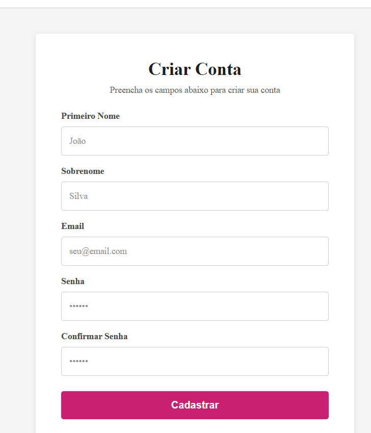

# Digital Store — Frontend

Este repositório contém o **frontend** do projeto **Digital Store**, desenvolvido como atividade final do curso de **Formação em Desenvolvedor Full Stack – Projeto Geração Tech**.

O projeto foi criado com o objetivo de aplicar os conceitos de **React**, organização de componentes, roteamento com `react-router-dom`, gerenciamento de estado global com **Context API** e consumo de API REST.

---

## Preview

<table>
  <tr>
    <td align="center"><br><b>Home</b></td>
    <td align="center"><br><b>Listagem de Produtos</b></td>
  </tr>
  <tr>
    <td align="center"><br><b>Categorias</b></td>
    <td align="center"><br><b>Meus Pedidos</b></td>
  </tr>
  <tr>
    <td align="center"><br><b>Login</b></td>
    <td align="center"><br><b>Criar Conta</b></td>
  </tr>
</table>

---

## Funcionalidades

- Listagem de produtos com filtros e ordenação
- Pesquisa de produtos
- Página de detalhes do produto com galeria de imagens
- Carrinho de compras com contexto global (Context API)
- Autenticação (Login / Cadastro) integrada ao backend
- Página de Meus Pedidos
- Layout responsivo

---

## Tecnologias Utilizadas

| Tecnologia | Uso |
|---|---|
| React | Biblioteca principal de UI |
| JavaScript (ES6+) | Linguagem principal |
| react-router-dom | Roteamento entre páginas |
| Context API | Gerenciamento de estado (carrinho) |
| CSS | Estilização com variáveis e Flexbox/Grid |
| Node.js / Express | Backend (API REST separada) |

---

## Estrutura de Diretórios

```
src/
├── assets/          # Ícones e imagens estáticas
├── components/      # Componentes reutilizáveis
│   ├── BuyBox/
│   ├── FilterGroup/
│   ├── Footer/
│   ├── Gallery/
│   ├── Header/
│   ├── ProductCard/
│   ├── ProductDetails/
│   ├── ProductListing/
│   └── ProductOptions/
├── context/
│   └── CartContext.js   # Contexto global do carrinho
├── pages/
│   ├── HomePage/
│   ├── ProductListingPage/
│   ├── ProductViewPage/
│   ├── CategoriesPage/
│   ├── OrdersPage/
│   ├── LoginPage/
│   └── SignupPage/
├── services/
│   └── api.js           # Configuração do axios/fetch
└── styles/
    └── colors.css        # Variáveis globais de cor
```

---

## Como Executar

### Pré-requisitos

- Node.js (v16+)
- npm

### Instalação

cd frontend
npm install
```

### Executar em desenvolvimento


npm start
```

O frontend sobe em `http://localhost:3001` por padrão.

---

## Configuração da API

Por padrão o frontend consome `http://localhost:3000/v1`.

Para alterar, crie um arquivo `.env` na pasta `frontend/` com:

```
REACT_APP_API_URL=http://localhost:3000/v1
```

### Rodando junto com o backend

1. Clone e suba o backend: [digital-store-backend](https://github.com/ZSSOUSA/digital-store-backend)
2. Inicie o frontend:

npm start
```

## Autor

- **Desenvolvedor:** Zaqueu Sousa
- **GitHub:** [github.com/ZSSOUSA](https://github.com/ZSSOUSA)

---

## Licença

MIT
